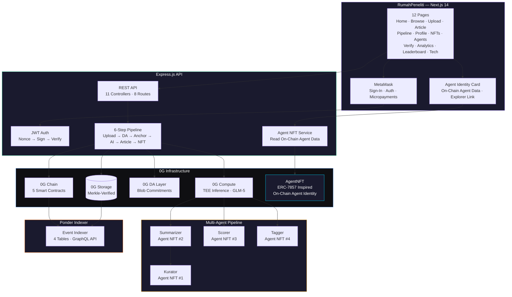
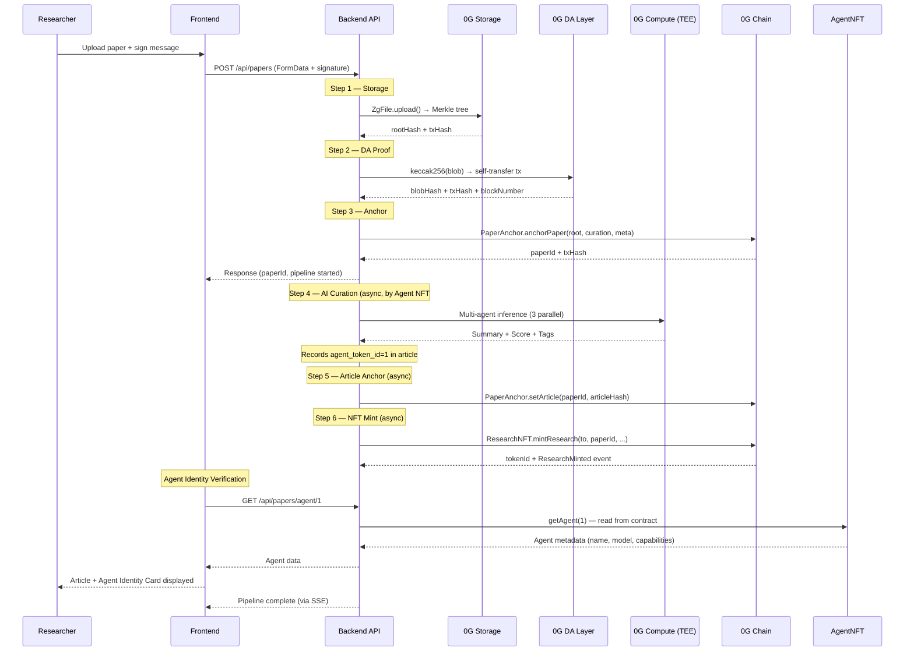
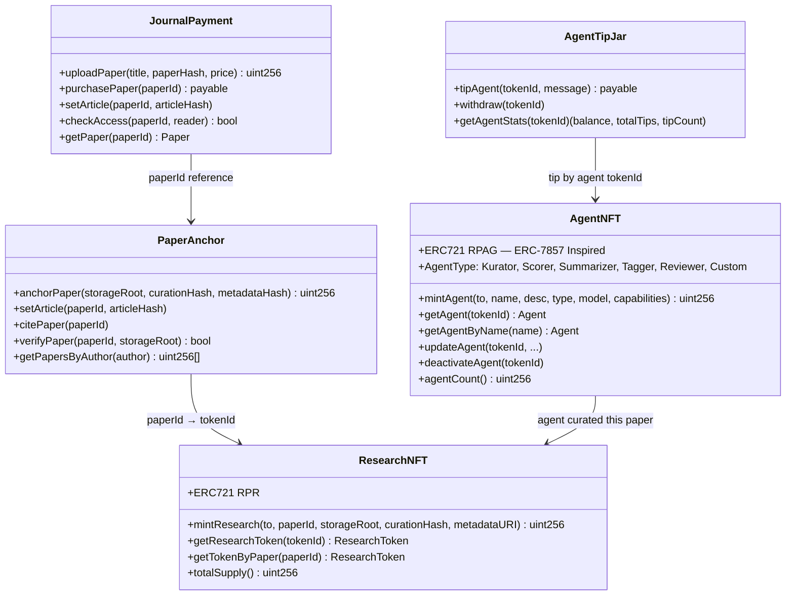

<p align="center">
  
  
  
  
  
  
</p>

<h1 align="center">RumahPeneliti</h1>
<h3 align="center">Autonomous AI Research Agents with On-Chain Identity on 0G</h3>

<p align="center">
  <i>AI agents curate research papers. Each agent has a verifiable blockchain identity. Every curation is traceable to its agent. No black box. No middleman.</i>
</p>

<p align="center">
  <a href="https://rumahpeneliti.com">Live App</a> ·
  <a href="https://chainscan.0g.ai/address/0xF5E23E98a6a93Db2c814a033929F68D5B74445E2">JournalPayment</a> ·
  <a href="https://chainscan.0g.ai/address/0x4ad80352231407Afa845c5428fa8fE870b4509A9">PaperAnchor</a> ·
  <a href="https://chainscan.0g.ai/address/0x78C414367A91917fe5DC8123119467c9910a4B6d">ResearchNFT</a> ·
  <a href="https://chainscan.0g.ai/address/0x9ebf66F0818db38BD55f1337b8a83E97c8e095C6">AgentNFT</a>
</p>

---

> **RumahPeneliti** (Indonesian: "Researcher's Home") is a decentralized autonomous research platform for the **0G APAC Hackathon 2026** (Track 3: Agentic Economy). It features **AI agents with on-chain identities** — each agent is registered as an ERC-7857 inspired NFT on 0G Chain. Researchers upload papers that are autonomously curated by these identified agents via **0G Compute**, stored on **0G Storage**, proven on **0G DA Layer**, anchored on **0G Chain**, and minted as NFTs. Every curation decision is traceable to a specific, verifiable AI agent.

---

## The Problem

Academic publishing is broken — and so is AI curation.

**Publishing:** Researchers hand copyright to publishers who charge $30-50 per paper view, while authors receive $0. Peer review takes months.

**AI Opacity:** When AI curates content, nobody knows which model was used, what version, or who deployed it. AI decisions are black boxes with zero accountability. If an AI agent produces biased scoring or hallucinated summaries, there's no way to trace, audit, or hold it accountable.

```
Current AI Curation:
  Paper → ??? (some AI model, who knows) → Curated Article
          No agent identity
          No version tracking
          No on-chain proof of who curated what
          No accountability for AI decisions
```

## The Solution

RumahPeneliti introduces **On-Chain Agent Identity** — every AI agent in our pipeline is registered as an NFT on 0G Chain with verifiable metadata. When a paper is curated, readers can see exactly which agent did the work, what model it uses, and verify its identity on-chain.

| Capability | What It Does | 0G Component |
|:---:|:---|:---:|
| **On-Chain Agent Identity** | AI agents registered as ERC-7857 inspired NFTs with verifiable metadata | 0G Chain |
| **Autonomous AI Curation** | 3 parallel agents + 1 reviewer, each with on-chain identity | 0G Compute |
| **Decentralized Storage** | Paper files stored permanently with Merkle proofs | 0G Storage |
| **Data Availability** | Blob commitments published on-chain for proof | 0G DA Layer |
| **On-Chain Anchoring** | Paper hashes, citations, and article hashes anchored in smart contracts | 0G Chain |
| **NFT Minting** | Every curated paper becomes a transferable ERC-721 NFT | 0G Chain |
| **Micropayments** | Readers pay authors directly in 0G tokens | 0G Chain |

---

## Agent Identity — How It Works

This is the core innovation for Track 3 (Agentic Economy). Each AI agent is minted as an NFT with structured on-chain metadata:

```solidity
struct Agent {
    string name;           // "AI Kurator"
    string description;    // "Multi-agent research curation pipeline..."
    AgentType agentType;   // Kurator, Scorer, Summarizer, Tagger, Reviewer
    string model;          // "GLM-5-FP8 via 0G Compute / Z.AI GLM-5.1 API"
    string capabilities;   // ["summarize","score","tag","classify","review"]
    address creator;       // Who deployed this agent
    bool active;           // Is this agent currently active
}
```

### Why This Matters

1. **Verifiability** — Readers verify which AI curated their paper by checking the agent NFT on-chain. Not "some AI" — a specific, identified agent.

2. **Accountability** — If an agent produces biased scores or hallucinated summaries, the agent identity is traceable. The agent can be deactivated on-chain.

3. **Agent Provenance** — Every curated article records which agent NFT performed the curation. This creates an immutable audit trail of AI decisions.

4. **Future: Transferable Agents** — Since agents are NFTs, they can be transferred, sold, or licensed. An agent with a track record of high-quality curation becomes a valuable asset.

### On-Chain Verification Flow

```
Paper curated by Agent NFT #1 (AI Kurator)
    ↓
Article stores: agent_token_id = 1, agent_nft_contract = 0x9ebf66F...
    ↓
Frontend fetches agent data from contract via RPC
    ↓
Reader sees: "Curated by AI Kurator — GLM-5-FP8 — VERIFIED ✓"
    ↓
Click "View Contract" → 0G Explorer shows full agent metadata
```

---

## Architecture

### System Overview



### Pipeline: Upload to NFT in ~40 Seconds



### Multi-Agent Curation with On-Chain Identity

```mermaid
flowchart LR
    A[Paper Uploaded] --> B{0G Compute<br/>Available?}
    B -->|Yes| C[0G Compute Network<br/>GLM-5-FP8 · TEE]
    B -->|No| D{Z.AI API<br/>Available?}
    D -->|Yes| E[GLM-5.1 API<br/>Fallback]
    D -->|No| F[Mock Data<br/>Final Fallback]
    C --> G
    E --> G
    F --> G

    subgraph G["3 Parallel Agents — Each with NFT Identity"]
        direction TB
        S["Summarizer · Agent NFT #2<br/>curated_title · summary<br/>key_takeaways · body"]
        SC["Scorer · Agent NFT #3<br/>novelty · clarity<br/>methodology · impact"]
        T["Tagger · Agent NFT #4<br/>tags · domain · subdomain<br/>research_type · difficulty"]
    end

    G --> H{Quality<br/>Threshold?}
    H -->|Below| I["Reviewer Agent<br/>On-demand re-evaluation"]
    H -->|Pass| J[Merged Result]
    I --> J
    J --> K["Curated Article<br/>agent_token_id = 1<br/>Stored in DB + Anchored On-Chain"]

    K --> L["Agent Identity Card<br/>Readers verify on-chain:<br/>Name · Model · Capabilities"]

    style A fill:#7c3aed,color:#fff
    style C fill:#2563eb,color:#fff
    style I fill:#f59e0b,color:#000
    style K fill:#34d399,color:#000
    style L fill:#00d4ff,color:#000
```



### Smart Contract Architecture



---

## Source of Truth — On-Chain First

The backend uses a local database for fast reads and caching, but the **source of truth is always on-chain**:

- Paper files live on **0G Storage** (decentralized, Merkle-verified, permanent)
- Paper hashes and metadata are anchored on **0G Chain** via PaperAnchor contract
- **AI Agent identities** are registered on **0G Chain** via AgentNFT contract (ERC-7857 inspired)
- A **Ponder indexer** independently indexes all on-chain events into 4 tables
- If the backend goes down, anyone can rebuild the entire index from on-chain events

---

## 0G Integration Proof

This project integrates **all 4 core 0G components** plus an **on-chain agent identity system**:

| Component | How It's Used | SDK |
|:---:|:---|:---|
| **0G Storage** | Paper files uploaded via `@0gfoundation/0g-ts-sdk`. Merkle tree built client-side. Root hash stored on-chain for verification. Supports upload, download. | `ZgFile`, `Indexer` |
| **0G Compute** | All AI inference via `@0glabs/0g-serving-broker`. GLM-5-FP8 model. TEE-verified responses via `processResponse()`. On-chain ledger billing with auto-deposit. | `createZGComputeNetworkBroker` |
| **0G DA Layer** | Blob commitments (`keccak256` of storage root + metadata) published as on-chain transactions. Self-transfer pattern with `RP:DA:` prefix. | `ethers.js v6` |
| **0G Chain** | 5 Solidity contracts: `JournalPayment`, `PaperAnchor`, `ResearchNFT`, `AgentNFT`, `AgentTipJar`. Handles anchoring, micropayments, NFT minting, citations, access control, agent identity, and agent tipping. | Hardhat, ethers.js |
| **Agent Identity** | ERC-7857 inspired `AgentNFT` contract. AI agents registered as NFTs with structured metadata (name, type, model, capabilities). Every curation linked to an on-chain agent. Verifiable via explorer. | Solidity 0.8.20, ethers.js |

### Contract Addresses (0G Mainnet)

| Contract | Address | Purpose | Explorer |
|:---|:---|:---|:---:|
| JournalPayment | `0xF5E23E98a6a93Db2c814a033929F68D5B74445E2` | Micropayments | [View](https://chainscan.0g.ai/address/0xF5E23E98a6a93Db2c814a033929F68D5B74445E2) |
| PaperAnchor | `0x4ad80352231407Afa845c5428fa8fE870b4509A9` | Hash verification | [View](https://chainscan.0g.ai/address/0x4ad80352231407Afa845c5428fa8fE870b4509A9) |
| ResearchNFT | `0x78C414367A91917fe5DC8123119467c9910a4B6d` | Paper NFTs | [View](https://chainscan.0g.ai/address/0x78C414367A91917fe5DC8123119467c9910a4B6d) |
| AgentNFT | `0x9ebf66F0818db38BD55f1337b8a83E97c8e095C6` | **AI Agent Identity** (ERC-7857) | [View](https://chainscan.0g.ai/address/0x9ebf66F0818db38BD55f1337b8a83E97c8e095C6) |
| AgentTipJar | `0x7e59BB6ff6C58D03C07bdFC35040b4A08779A9f6` | **Agent Tipping** (Agentic Economy) | [View](https://chainscan.0g.ai/address/0x7e59BB6ff6C58D03C07bdFC35040b4A08779A9f6) |

---

## Key Features

<table>
<tr>
<td width="50%">

### On-Chain Agent Identity
Every AI agent is registered as an ERC-7857 inspired NFT on 0G Chain. Agent metadata (name, model, capabilities, status) is stored on-chain. Readers verify which agent curated their paper — not "some AI", but a specific, identifiable agent with a blockchain identity.

</td>
<td width="50%">

### Multi-Agent AI Curation
3 parallel agents (Summarizer, Scorer, Tagger) run through 0G Compute's TEE inference. Each agent has a distinct role — one generates the article, one scores quality across 4 dimensions, one classifies and tags. A 4th Reviewer agent re-evaluates papers that fall below threshold.

</td>
</tr>
<tr>
<td>

### Agent-Provenance Tracking
Every curated article records its agent's NFT token ID. This creates an immutable audit trail: "Paper X was curated by Agent #1 (AI Kurator) using GLM-5-FP8 on 0G Compute." Readers click "View Contract" to verify on the 0G explorer.

</td>
<td>

### Full Pipeline — End to End
Upload → 0G Storage → DA Proof → On-Chain Anchor → AI Curation (by identified agent) → Article Anchor → NFT Mint. The entire flow completes in ~40 seconds. Steps 1-3 are synchronous, steps 4-6 run async with SSE progress updates.

</td>
</tr>
<tr>
<td>

### Gasless UX
Backend sponsors all gas fees via a hot wallet. Users never need to hold tokens or sign transactions for NFT minting. The only wallet interaction is a single signature to verify identity on connect.

</td>
<td>

### On-Chain Verification
Paper integrity is verifiable by anyone. `PaperAnchor.verifyPaper()` checks the storage root matches the on-chain record. Agent identity is verifiable via `AgentNFT.getAgent(tokenId)`. The Ponder indexer independently tracks all events.

</td>
</tr>
<tr>
<td>

### Signature-Gated Upload
Before AI curation runs, the user must sign a submission message via MetaMask. The backend verifies this signature against the PaperAnchor contract. No signature = no AI execution. Prevents spam and ensures accountability.

</td>
<td>

### Micropayments & Donations
Authors set a price in 0G tokens (or free). Readers pay directly to the author via `JournalPayment.purchasePaper()`. No publisher takes a cut. Free papers still allow reader donations.

</td>
</tr>
</table>

---

## Quick Start

### Prerequisites
- Node.js >= 18
- MetaMask or compatible wallet
- 0G tokens on Mainnet

### Setup

```bash
git clone https://github.com/akzmee/rumah-peneliti
cd rumah-peneliti

# Install all dependencies
make install

# Configure environment
cp .env.example .env
# Edit .env — add LLM_API_KEY, PRIVATE_KEY, contract addresses
cp frontend/.env.local.example frontend/.env.local

# Database auto-seeds on first backend start
```

### Run

```bash
# Start both backend (:3001) and frontend (:3000)
make dev

# Or run individually
cd backend && npm run dev       # Express with --watch
cd frontend && npm run dev      # Next.js on :3000
cd indexer && npm run dev       # Ponder GraphQL on :42069
```

### Deploy Agent Identity

```bash
cd contracts
npx hardhat compile

# Deploy AgentNFT to 0G mainnet
npx hardhat run scripts/deploy-agent.js --network zeroMainnet

# Mint AI Kurator agent
npx hardhat run scripts/mint-agent.js --network zeroMainnet
```

### Test

```bash
make test                       # All tests (auth + E2E)
make test-auth                  # Auth flow (24 tests)
make test-e2e                   # Full E2E browser tests (77 tests)
npx playwright test e2e/agent-identity.spec.js  # Agent Identity E2E (6 tests)
cd backend && npm run test:api  # Vitest API pipeline tests
```

---

## Project Structure

```
rumah-peneliti
├── backend/                     # Express.js API server
│   └── src/
│       ├── controllers/         # 11 controllers (papers, auth, analytics, nft, pipeline...)
│       ├── routes/              # 8 route modules
│       ├── services/
│       │   ├── storage.js       # 0G Storage upload (ZgFile, Indexer, Merkle)
│       │   ├── da-layer.js      # 0G DA Layer blob commitment proofs
│       │   ├── anchor.js        # PaperAnchor on-chain service
│       │   ├── og-compute.js    # 0G Compute Network client (GLM-5)
│       │   ├── multi-agent.js   # 3 parallel AI agents + orchestrator
│       │   ├── agent-nft.js     # On-chain Agent Identity reader
│       │   ├── kurasi.js        # AI curation orchestrator (0G → API → Mock)
│       │   └── nft.js           # ResearchNFT gasless minting
│       ├── middleware/           # JWT auth, error handler
│       └── db.js                # SQLite setup + auto-seed
├── frontend/                    # Next.js 14 App Router
│   └── src/
│       ├── app/                 # 12 pages (home, browse, upload, article, pipeline, nfts, agents...)
│       ├── components/
│       │   ├── article/         # AI chat, score, agent-identity, on-chain-data, sidebar
│       │   ├── shared/          # Wallet modal with multi-wallet deduplication
│       │   ├── home/            # Hero, stats, latest-papers, how-it-works
│       │   └── ui/              # 14 shadcn/ui primitives
│       ├── contexts/            # React Context (wallet, theme, language)
│       └── lib/                 # Auth, API client, constants (5 contract addresses)
├── contracts/                   # Solidity smart contracts
│   ├── contracts/
│   │   ├── JournalPayment.sol   # Micropayments
│   │   ├── PaperAnchor.sol      # Paper hash verification + citations
│   │   ├── ResearchNFT.sol      # ERC-721 NFT minting
│   │   ├── AgentNFT.sol         # ERC-7857 inspired on-chain agent identity
│   │   └── AgentTipJar.sol      # On-chain agent tipping (Agentic Economy)
│   └── scripts/
│       ├── deploy-agent.js      # Deploy AgentNFT contract
│       ├── deploy-tipjar.js     # Deploy AgentTipJar contract
│       ├── mint-agent.js        # Mint AI Kurator agent NFT
│       ├── mint-agents.js       # Mint Summarizer, Scorer, Tagger agents
│       ├── deploy-mainnet.js    # Deploy all contracts to mainnet
│       └── deploy.js            # Deploy to testnet
├── indexer/                     # Ponder blockchain event indexer
│   ├── ponder.config.ts         # Chain config + contract addresses
│   ├── ponder.schema.ts         # 4 tables schema
│   └── src/                     # Event handlers + Hono REST API
└── e2e/                         # Playwright E2E test suite
    ├── frontend.spec.js         # 26 general UI tests
    └── agent-identity.spec.js   # 6 agent identity specific tests
```

---

## Tech Stack

| Layer | Technology |
|:---|:---|
| Smart Contracts | Solidity 0.8.20, Hardhat, OpenZeppelin v5 (ERC-721, Ownable) — 5 contracts deployed on 0G Mainnet |
| Agent Identity | ERC-7857 inspired AgentNFT — on-chain agent metadata, verifiable identity |
| AI Inference | GLM-5-FP8 via 0G Compute (TEE), Z.AI GLM-5.1 API (fallback) |
| 0G Storage | `@0gfoundation/0g-ts-sdk` — Merkle proofs, upload/download |
| 0G Compute | `@0glabs/0g-serving-broker` — TEE inference, on-chain billing |
| Backend | Express.js, better-sqlite3, JWT auth, Multer |
| Frontend | Next.js 14, React 18, Tailwind CSS, shadcn/ui (Radix), Ethers.js v6 |
| Indexer | Ponder v0.7, PGLite, Viem, Hono |
| Blockchain | 0G Mainnet (Chain ID 16661) |
| Testing | Vitest (API), Playwright (E2E) — 16 API pipeline tests + 6 agent identity E2E tests |

---

## Key Differentiators

| | RumahPeneliti | Traditional Publisher | AI-Only Platform |
|:---|:---|:---|:---|
| **Agent Identity** | On-chain NFT (ERC-7857 inspired) | N/A | No identity, black box |
| **Agent Accountability** | Deactivatable on-chain | N/A | None |
| **Curation Provenance** | Every article linked to agent NFT | Manual review | No traceability |
| **Storage** | 0G Storage (decentralized, permanent) | Centralized servers | Centralized |
| **Payments** | Direct to author, 0% cut | $30-50/view, author gets $0 | Subscription |
| **Ownership** | ERC-721 NFT (transferable) | Copyright to publisher | No ownership |
| **Verification** | On-chain hash + Merkle proof | None | None |
| **Availability** | Decentralized + independently indexable | Single point of failure | Single point of failure |

---

## License

MIT

---

<p align="center">
  Built for the <a href="https://www.hackquest.io/hackathons/0G-APAC-Hackathon">0G APAC Hackathon 2026</a> (Track 3: Agentic Economy & Autonomous Applications)
  <br/>
  <b>#0GHackathon #BuildOn0G</b>
</p>
