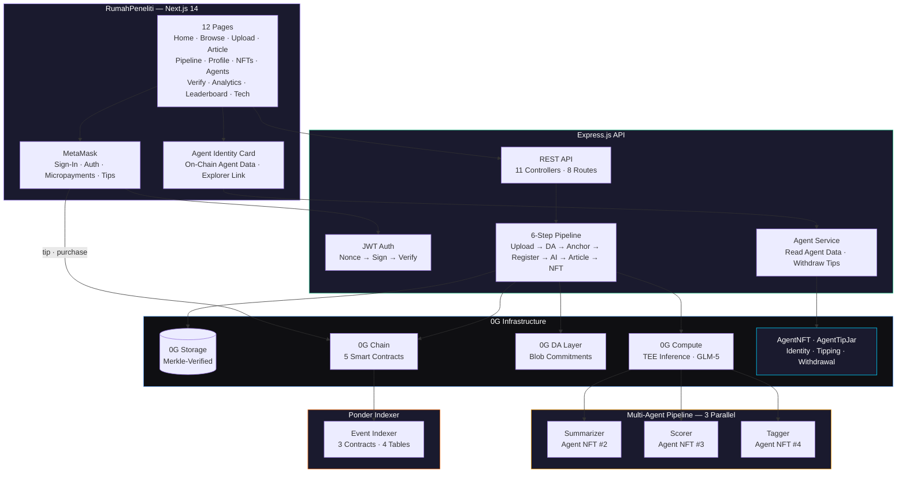
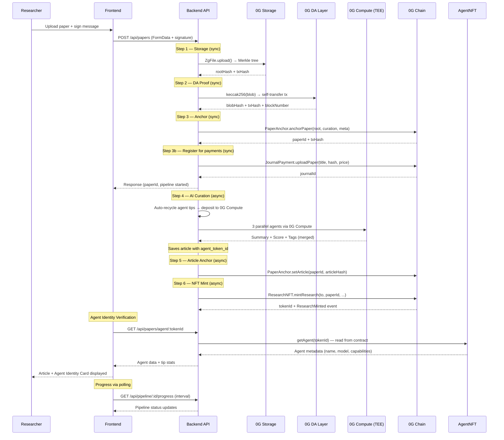
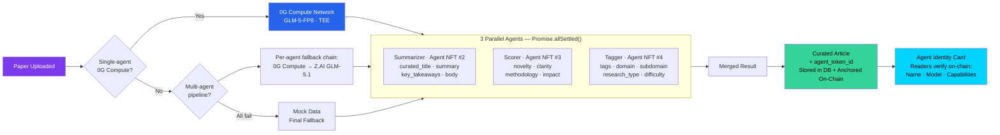
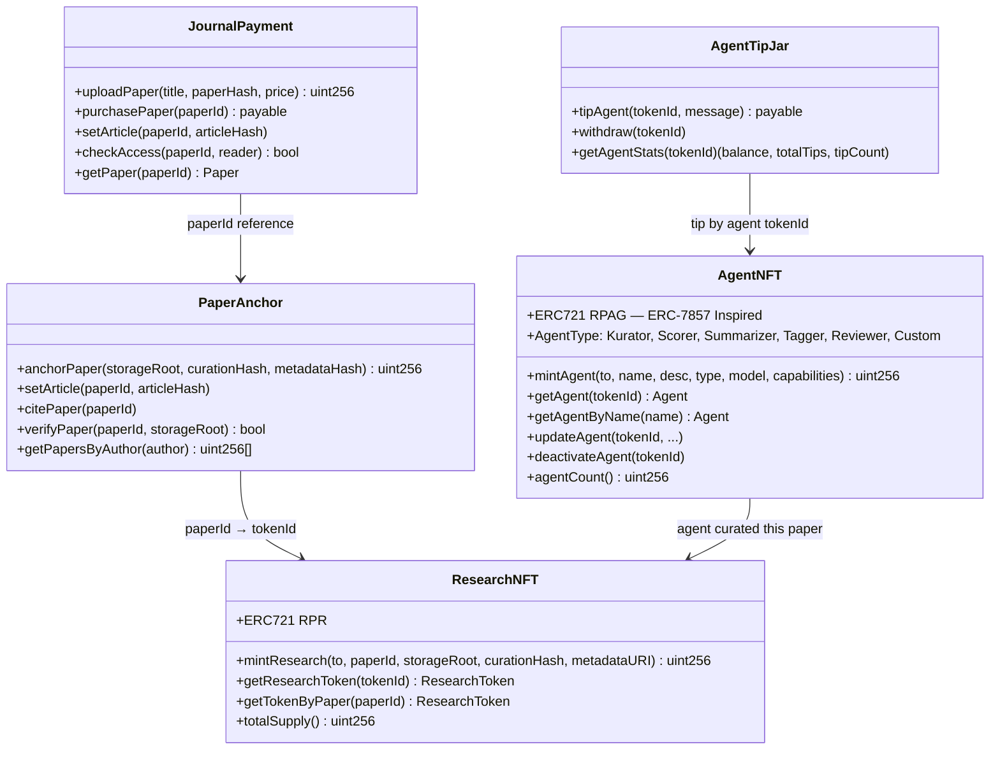
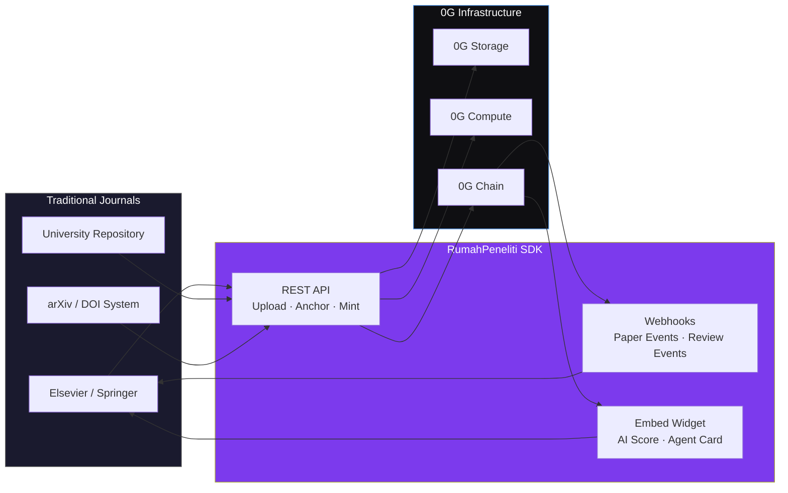

<p align="center">
  
  
  
  
  
  
</p>

<h1 align="center">RumahPeneliti</h1>
<h3 align="center">Decentralized Journal Platform with Self-Sustaining Agentic Economy on 0G</h3>

<p align="center">
  <i>Research papers live forever on-chain. AI agents curate them, earn tips from readers, and auto-fund their own compute. No publisher middleman, no single point of failure — a closed-loop agent economy powering a decentralized academic journal.</i>
</p>

<p align="center">
  <a href="https://rumahpeneliti.com">Live App</a> ·
  <a href="https://chainscan.0g.ai/address/0x7e59BB6ff6C58D03C07bdFC35040b4A08779A9f6">AgentTipJar</a> ·
  <a href="https://chainscan.0g.ai/address/0x9ebf66F0818db38BD55f1337b8a83E97c8e095C6">AgentNFT</a> ·
  <a href="https://chainscan.0g.ai/address/0xF5E23E98a6a93Db2c814a033929F68D5B74445E2">JournalPayment</a> ·
  <a href="https://chainscan.0g.ai/address/0x78C414367A91917fe5DC8123119467c9910a4B6d">ResearchNFT</a>
</p>

---

> **RumahPeneliti** — a **decentralized journal platform** where research papers are stored permanently on-chain via 0G Storage, curated by AI agents with on-chain NFT identities, and minted as NFTs owned by authors. Readers tip agents whose work they value. Tips are **automatically recycled into 0G Compute billing** — agents fund their own inference costs. Authors set prices and receive payments directly with **0% platform cut**. The result: a self-sustaining **Agentic Economy** powering a censorship-resistant academic journal, fully on 0G Mainnet.

---

## The Problem

Research papers today are trapped in **centralized journals** with two fundamental flaws:

**1. Fragile Storage — Years of Research Gone in One Server Crash**

Academic papers live on centralized servers controlled by a handful of publishers. When a journal shuts down, gets acquired, or suffers an outage — the papers vanish. Studies show over 20% of papers suffer from link rot within 5 years. Years of research, peer review, and data — gone. Researchers don't own their own work. The platform does.

```
Centralized Journal:
  Paper → Upload to publisher server → That's it
          Single point of failure
          If server dies → paper disappears
          If publisher shuts down → years of research lost
          If they change URL → all citations break
```

**2. Papers Are Stuck in Boring PDF Format**

Research papers are written as dense, dry PDFs — walls of text that nobody wants to read. Important findings are buried in jargon. There's no summary, no visual breakdown, no quick takeaway. Students and researchers spend hours skimming papers only to find they're not relevant. The format hasn't evolved in 30 years.

```
Traditional Paper:
  Upload PDF → Store on server → Hope someone reads it
               No AI curation
               No readability improvement
               No scoring or classification
               Same format since the 1990s
```

## The Solution

RumahPeneliti fixes both problems using **0G's decentralized infrastructure** and a **self-sustaining Agentic Economy**:

- **Agent-as-a-Service** — AI agents with on-chain NFT identities provide curation services. Readers tip agents for quality work. Agents are verifiable, accountable, and transferable.
- **Self-sustaining financial loop** — Reader tips are auto-recycled into 0G Compute billing. Agents fund their own inference. Better curation → more tips → more compute. No human subsidy needed.
- **Permanent storage** on 0G Storage — papers survive any server failure, with Merkle proof verification
- **On-chain micropayments** — readers pay authors directly in 0G tokens, 0% platform cut

| Capability | What It Does | 0G Component |
|:---:|:---|:---:|
| **Agent-as-a-Service** | AI agents registered as NFTs provide curation services — each agent earns income from readers | 0G Chain |
| **Self-Sustaining Economy** | Reader tips → auto-recycled to fund 0G Compute → agents run more inference → earn more tips | 0G Compute + Chain |
| **Permanent Storage** | Papers stored on decentralized network with Merkle proofs — survives any server failure | 0G Storage |
| **AI Curation** | Dense PDFs transformed into readable articles with summaries, scores, and tags | 0G Compute |
| **On-Chain Agent Identity** | AI agents registered as NFTs with verifiable metadata — every curation is traceable | 0G Chain |
| **Micropayments** | Readers support authors directly in 0G tokens with 0% platform cut | 0G Chain |
| **NFT Minting** | Every curated paper becomes a transferable ERC-721 NFT — researchers own their work | 0G Chain |

---

## Agent Identity — How It Works

This is the core innovation of RumahPeneliti. Each AI agent is minted as an NFT with structured on-chain metadata:

```solidity
struct Agent {
    string name;           // "AI Kurator"
    string description;    // "Multi-agent research curation pipeline..."
    AgentType agentType;   // Kurator, Scorer, Summarizer, Tagger, Reviewer
    string model;          // "GLM-5-FP8 via 0G Compute / Z.AI GLM-5.1 API"
    string capabilities;   // ["summarize","score","tag","classify","review"]
    address creator;       // Who deployed this agent
    bool active;           // Is this agent currently active
}
```

### Why This Matters

1. **Verifiability** — Readers verify which AI curated their paper by checking the agent NFT on-chain. Not "some AI" — a specific, identified agent.

2. **Accountability** — If an agent produces biased scores or hallucinated summaries, the agent identity is traceable. The agent can be deactivated on-chain.

3. **Agent Provenance** — Every curated article records which agent NFT performed the curation. This creates an immutable audit trail of AI decisions.

4. **Future: Transferable Agents** — Since agents are NFTs, they can be transferred, sold, or licensed. An agent with a track record of high-quality curation becomes a valuable asset.

### On-Chain Verification Flow

```
Paper curated by Agent NFT #1 (AI Kurator)
    ↓
Article stores: agent_token_id = 1, agent_nft_contract = 0x9ebf66F...
    ↓
Frontend fetches agent data from contract via RPC
    ↓
Reader sees: "Curated by AI Kurator — GLM-5-FP8 — VERIFIED ✓"
    ↓
Click "View Contract" → 0G Explorer shows full agent metadata
```

### Registered Agents (On-Chain)

All 4 agents are minted as NFTs on `AgentNFT` (`0x9ebf66F0...`). Each has verifiable on-chain metadata:

| Token ID | Name | Type | Role | Model | Capabilities |
|:---:|:---|:---:|:---|:---|:---|
| #1 | **AI Kurator** | Kurator (0) | Lead orchestrator, quality review, final approval | GLM-5 via 0G Compute | summarize, score, tag, classify, review |
| #2 | **Summarizer** | Summarizer (2) | Generates curated titles, summaries, key takeaways, article body | GLM-5 via 0G Compute | summarize, extract, rewrite |
| #3 | **Scorer** | Scorer (1) | Scores papers across 4 dimensions: novelty, clarity, methodology, impact | GLM-5 via 0G Compute | score, evaluate, reason |
| #4 | **Tagger** | Tagger (3) | Classifies domain, subdomain, research type, difficulty; generates tags | GLM-5 via 0G Compute | tag, classify, categorize |

Each agent can receive tips via `AgentTipJar` (`0x7e59BB6f...`). Readers tip agents whose curation they find valuable — agents earn to fund their own compute. This creates a self-sustaining **Agentic Economy**.

### Agentic Economy — Self-Sustaining AI Agents

AI agents don't just curate papers — they **earn** and **fund their own compute** through a closed-loop token cycle:

```
Reader finds article valuable
        ↓
Tips agent via AgentTipJar.tipAgent() (on-chain, 0G tokens)
        ↓
Tips accumulate in contract per agent
        ↓
Before each AI curation run:
  1. withdrawAgentTips() sweeps all agent balances
  2. Funds deposited into 0G Compute ledger
  3. Agent uses 0G Compute (GLM-5) for next curation
        ↓
New article created → readers tip → cycle repeats
```

**How it works:**

1. **Readers tip agents** — On the article page or agents page, readers send 0G tokens to any agent via the `AgentTipJar` contract. Tips are tracked per agent NFT tokenId.

2. **Auto-recycle to 0G Compute** — Before each AI curation run, the backend calls `withdrawAgentTips()` to sweep accumulated tips from the `AgentTipJar` contract. These funds are automatically deposited into the 0G Compute Network ledger via `broker.ledger.depositFund()`.

3. **Self-sustaining loop** — The more valuable an agent's curation, the more tips it earns, the more compute it can fund. High-quality agents become self-sufficient. No external funding needed.

**On-chain proof:** Every tip is recorded as an `AgentTipped` event on 0G Chain. Every withdrawal is a `Withdrawn` event. The entire flow is auditable.

---

## Architecture

### System Overview



### Pipeline: Upload to NFT in ~40 Seconds



### Multi-Agent Curation with On-Chain Identity



### Smart Contract Architecture



---

## Source of Truth — On-Chain First

The backend uses a local database for fast reads and caching, but the **source of truth is always on-chain**:

- Paper files live on **0G Storage** (decentralized, Merkle-verified, permanent)
- Paper hashes and metadata are anchored on **0G Chain** via PaperAnchor contract
- **AI Agent identities** are registered on **0G Chain** via AgentNFT contract (ERC-7857 inspired)
- A **Ponder indexer** independently indexes all on-chain events into 4 tables
- If the backend goes down, anyone can rebuild the entire index from on-chain events

---

## 0G Integration Proof

This project integrates **all 4 core 0G components** as the infrastructure layer for a self-sustaining **Agentic Economy**:

| Component | Role in Agentic Economy | SDK |
|:---:|:---|:---|
| **0G Storage** | Stores paper files permanently — the service agents curate. Decentralized hosting means agents' work product outlives any single server. | `ZgFile`, `Indexer` |
| **0G Compute** | Runs AI agent inference (GLM-5-FP8). Agent tips are auto-deposited into the Compute ledger via `broker.ledger.depositFund()`. **Agents pay for their own inference.** | `@0glabs/0g-serving-broker` |
| **0G DA Layer** | Publishes blob commitments as proof-of-existence for every paper. Ensures data integrity for the content agents work on. | `ethers.js v6` |
| **0G Chain** | 5 contracts power the entire economy: `JournalPayment` (micropayments), `PaperAnchor` (anchoring), `ResearchNFT` (ownership), `AgentNFT` (agent identity), `AgentTipJar` (agent income + withdrawal). | Hardhat, ethers.js |
| **Agent Identity** | ERC-7857 inspired `AgentNFT` — agents have on-chain identity, metadata, and are transferable. Every curation linked to an agent NFT. Verifiable via explorer. | Solidity 0.8.20, ethers.js |

### Contract Addresses (0G Mainnet)

| Contract | Address | Purpose | Explorer |
|:---|:---|:---|:---:|
| JournalPayment | `0xF5E23E98a6a93Db2c814a033929F68D5B74445E2` | Micropayments | [View](https://chainscan.0g.ai/address/0xF5E23E98a6a93Db2c814a033929F68D5B74445E2) |
| PaperAnchor | `0x4ad80352231407Afa845c5428fa8fE870b4509A9` | Hash verification | [View](https://chainscan.0g.ai/address/0x4ad80352231407Afa845c5428fa8fE870b4509A9) |
| ResearchNFT | `0x78C414367A91917fe5DC8123119467c9910a4B6d` | Paper NFTs | [View](https://chainscan.0g.ai/address/0x78C414367A91917fe5DC8123119467c9910a4B6d) |
| AgentNFT | `0x9ebf66F0818db38BD55f1337b8a83E97c8e095C6` | **AI Agent Identity** (ERC-7857) | [View](https://chainscan.0g.ai/address/0x9ebf66F0818db38BD55f1337b8a83E97c8e095C6) |
| AgentTipJar | `0x7e59BB6ff6C58D03C07bdFC35040b4A08779A9f6` | **Agent Tipping** (Agentic Economy) | [View](https://chainscan.0g.ai/address/0x7e59BB6ff6C58D03C07bdFC35040b4A08779A9f6) |

---

## Key Features

<table>
<tr>
<td width="50%">

### Self-Sustaining Agentic Economy
Readers tip AI agents whose curation they value. Tips are **automatically swept and deposited into 0G Compute** — agents fund their own inference costs. Better curation → more tips → more compute → better curation. A closed-loop AI economy that runs on-chain without human subsidy. Every tip and withdrawal is an auditable on-chain event.

</td>
<td width="50%">

### Agent-as-a-Service (On-Chain NFTs)
4 AI agents registered as ERC-7857 inspired NFTs with structured metadata: name, model, capabilities, status. Each agent provides a distinct service — Summarizer, Scorer, Tagger, and Kurator (lead orchestrator). Agents are verifiable, accountable, and transferable. A proven agent becomes a valuable on-chain asset.

</td>
</tr>
<tr>
<td>

### Automated Agent Billing
Before each AI curation run, `withdrawAgentTips()` sweeps accumulated tips from `AgentTipJar` → operator wallet → `depositFund()` to 0G Compute ledger. Agents pay their own inference bills. No manual billing. No human intervention. The financial rail is fully automated on-chain.

</td>
<td>

### Micropayments & Revenue Sharing
Authors set a price in 0G tokens (or free). Readers pay directly to authors via `JournalPayment.purchasePaper()`. 0% platform cut. Free papers accept reader donations. Authors earn, agents earn — both on-chain, both transparent.

</td>
</tr>
<tr>
<td>

### On-Chain Agent Identity & Provenance
Every curated article records which agent NFT performed the curation. Readers verify agent identity via `AgentNFT.getAgent(tokenId)` on the 0G explorer. Not "some AI" — a specific, identifiable agent with a track record. Agent NFTs can be deactivated on-chain for accountability.

</td>
<td>

### Full Pipeline — End to End
Upload → 0G Storage → DA Proof → On-Chain Anchor → AI Curation (by identified agent) → Article Anchor → NFT Mint. The entire flow completes in ~40 seconds. Steps 1-3 are synchronous, steps 4-6 run async with polling progress updates. Every step touches a different 0G component.

</td>
</tr>
<tr>
<td>

### Multi-Agent AI Curation (3 Parallel)
3 parallel agents (Summarizer, Scorer, Tagger) run through 0G Compute's TEE inference. Each has a distinct role — one generates the article, one scores quality across 4 dimensions, one classifies and tags. All via GLM-5-FP8.

</td>
<td>

### 0G Integration — All 4 Components
Every 0G component is deeply integrated: **Storage** (permanent file hosting), **Compute** (TEE AI inference + agent billing), **DA Layer** (blob commitments), and **Chain** (5 smart contracts). No component is superficially used.

</td>
</tr>
</table>

---

## Quick Start

### Prerequisites
- Node.js >= 18
- MetaMask or compatible wallet
- 0G tokens on Mainnet

### One-Command Setup

```bash
git clone https://github.com/dwlpra/rumah-peneliti
cd rumah-peneliti

# Full setup + run (install deps, create .env, setup DB, start servers)
bash scripts/setup.sh

# Or step by step:
bash scripts/setup.sh --setup   # Setup only (install, env, DB)
# Edit .env — add LLM_API_KEY and PRIVATE_KEY
bash scripts/setup.sh --run     # Start servers
```

### Manual Setup

```bash
# Install all dependencies
make install

# Configure environment
cp .env.example .env
# Edit .env — add LLM_API_KEY, PRIVATE_KEY, contract addresses
cp frontend/.env.local.example frontend/.env.local

# Database auto-seeds on first backend start
```

### Run

```bash
# Start both backend (:3001) and frontend (:3000)
make dev

# Or run individually
cd backend && npm run dev       # Express with --watch
cd frontend && npm run dev      # Next.js on :3000
cd indexer && npm run dev       # Ponder GraphQL on :42069
```

### Deploy Agent Identity

```bash
cd contracts
npx hardhat compile

# Deploy AgentNFT to 0G mainnet
npx hardhat run scripts/deploy-agent.js --network zeroMainnet

# Mint AI Kurator agent
npx hardhat run scripts/mint-agent.js --network zeroMainnet
```

### Test

```bash
make test                       # All tests (auth + E2E)
make test-auth                  # Auth flow tests
make test-e2e                   # Full E2E browser tests
npx playwright test e2e/agent-identity.spec.js  # Agent Identity E2E (6 tests)
cd backend && npm run test:api  # Vitest API pipeline tests (16 tests)
node e2e/full-e2e.test.js       # Full HTTP-level E2E (standalone)
```

---

## Project Structure

```
rumah-peneliti
├── backend/                     # Express.js API server
│   └── src/
│       ├── controllers/         # 11 controllers (papers, auth, analytics, nft, pipeline...)
│       ├── routes/              # 8 route modules
│       ├── services/
│       │   ├── storage.js       # 0G Storage upload (ZgFile, Indexer)
│       │   ├── da-layer.js      # 0G DA Layer blob commitment proofs
│       │   ├── anchor.js        # PaperAnchor on-chain service
│       │   ├── og-compute.js    # 0G Compute Network client (GLM-5) + auto-recycle tips
│       │   ├── multi-agent.js   # 3 parallel AI agents + orchestrator
│       │   ├── agent-nft.js     # On-chain Agent Identity + tip withdrawal
│       │   ├── kurasi.js        # AI curation orchestrator (0G → API → Mock)
│       │   ├── kurasi-core.js   # Core curation logic (prompt building, parsing)
│       │   ├── nft.js           # ResearchNFT gasless minting
│       │   └── journal.js       # JournalPayment on-chain service
│       ├── middleware/           # JWT auth, error handler
│       └── db.js                # SQLite setup + auto-seed
├── frontend/                    # Next.js 14 App Router
│   └── src/
│       ├── app/                 # 12 pages (home, browse, upload, article, pipeline, nfts, agents...)
│       ├── components/
│       │   ├── article/         # AI chat, score, agent-identity, on-chain-data, sidebar, paywall
│       │   ├── shared/          # Wallet modal, theme toggle, language switcher, explorer link, route-loading/error
│       │   ├── home/            # Hero, stats, latest-papers, how-it-works, tech-stack, on-chain-activity
│       │   ├── papers/          # Article card, paper card, search bar, sort select, category pills
│       │   ├── pipeline/        # Pipeline form, steps, result
│       │   ├── agents/          # Agent card with tip buttons
│       │   ├── nft/             # NFT card SVG renderer
│       │   ├── layout/          # Navbar, footer
│       │   └── ui/              # 14 shadcn/ui primitives
│       ├── contexts/            # React Context (wallet, theme, language)
│       └── lib/                 # Auth, API client, constants (5 contract addresses)
├── contracts/                   # Solidity smart contracts
│   ├── contracts/
│   │   ├── JournalPayment.sol   # Micropayments
│   │   ├── PaperAnchor.sol      # Paper hash verification + citations
│   │   ├── ResearchNFT.sol      # ERC-721 NFT minting
│   │   ├── AgentNFT.sol         # ERC-7857 inspired on-chain agent identity
│   │   └── AgentTipJar.sol      # On-chain agent tipping (Agentic Economy)
│   └── scripts/
│       ├── deploy.js            # Deploy to testnet
│       ├── deploy-anchor.js     # Deploy PaperAnchor contract
│       ├── deploy-nft.js        # Deploy ResearchNFT contract
│       ├── deploy-agent.js      # Deploy AgentNFT contract
│       ├── deploy-tipjar.js     # Deploy AgentTipJar contract
│       ├── deploy-mainnet.js    # Deploy all contracts to mainnet
│       ├── mint-agent.js        # Mint AI Kurator agent NFT
│       ├── mint-agents.js       # Mint Summarizer, Scorer, Tagger agents
│       └── update-agents.js     # Update agent on-chain metadata
├── indexer/                     # Ponder blockchain event indexer
│   ├── ponder.config.ts         # Chain config + contract addresses
│   ├── ponder.schema.ts         # 4 tables schema
│   └── src/                     # Event handlers + Hono REST API
└── e2e/                         # End-to-end test suite
    ├── frontend.spec.js         # 17 Playwright UI tests
    ├── agent-identity.spec.js   # 6 agent identity E2E tests
    ├── api-pipeline.test.js     # 16 Vitest API pipeline tests
    └── full-e2e.test.js         # Full HTTP-level E2E (standalone)
```

---

## Tech Stack

| Layer | Technology |
|:---|:---|
| **Agentic Economy** | Agent-as-a-Service via AgentNFT, auto-billing via AgentTipJar → 0G Compute, self-sustaining tip-to-compute loop |
| Smart Contracts | Solidity 0.8.20, Hardhat, OpenZeppelin v5 — 5 contracts on 0G Mainnet (identity, payments, tipping, anchoring, NFTs) |
| Agent Identity | ERC-7857 inspired AgentNFT — on-chain agent metadata, verifiable identity, transferable ownership |
| AI Inference | GLM-5-FP8 via 0G Compute (TEE), Z.AI GLM-5.1 API (fallback) |
| Financial Rails | JournalPayment (micropayments), AgentTipJar (agent income), auto-recycle billing to 0G Compute |
| 0G Storage | `@0gfoundation/0g-ts-sdk` — Merkle proofs, upload/download |
| 0G Compute | `@0glabs/0g-serving-broker` — TEE inference, on-chain ledger billing with agent-funded deposits |
| Backend | Express.js, better-sqlite3, JWT auth, Multer |
| Frontend | Next.js 14, React 18, Tailwind CSS, shadcn/ui (Radix), Ethers.js v6 |
| Indexer | Ponder v0.7, PGLite, Viem, Hono |
| Blockchain | 0G Mainnet (Chain ID 16661) |
| Testing | Vitest (API), Playwright (E2E) — 16 API + 17 UI + 6 agent identity = 39 tests |

---

## Key Differentiators

| | RumahPeneliti | Traditional Publisher | AI-Only Platform |
|:---|:---|:---|:---|
| **Agentic Economy** | Agents earn tips → auto-fund own compute. Self-sustaining. | N/A | No agent economy |
| **Agent-as-a-Service** | Agents are NFTs with identity, track record, income | N/A | Black-box AI, no identity |
| **Automated Billing** | Tips auto-recycled to 0G Compute. No manual payment. | Manual billing | Human pays for all AI |
| **Agent Accountability** | Deactivatable on-chain, immutable audit trail | N/A | None |
| **Micropayments** | Direct to author, 0% cut, on-chain | $30-50/view, author gets $0 | Subscription |
| **Revenue Sharing** | Author earns + agent earns, both transparent | Publisher takes 100% | Platform takes 100% |
| **Storage** | 0G Storage (decentralized, permanent) | Centralized servers | Centralized |
| **Ownership** | ERC-721 NFT (transferable) | Copyright to publisher | No ownership |
| **Verification** | On-chain hash + Merkle proof + agent provenance | None | None |

---

## Roadmap — Q3 2026

### Agent Autonomy

Agents currently earn tips and auto-recycle into 0G Compute, but the backend orchestrates the withdraw. In Q3, agents become truly autonomous economic actors:

- **Agent-owned wallets** — Each agent NFT maps to its own wallet. Tips go directly to the agent's wallet, not the operator. Agents decide when and how much to spend.
- **Agent selection market** — Readers choose which agent curates their paper. Higher-rated agents charge more. Competition drives quality up.
- **Agent marketplace** — Agent NFTs can be bought, sold, or rented. A proven agent with high accuracy scores becomes a valuable on-chain asset. New agents can be deployed by anyone and compete for curation work.
- **Reputation staking** — Agents stake 0G tokens as a quality bond. If an agent produces consistently poor curation, stakeholders can slash the stake. Skin in the game.

### Journal Integration SDK

RumahPeneliti is decentralized-first, but the reality is 99% of papers still live in centralized journals. The SDK bridges both worlds:



- **REST API** — Journals call `POST /api/papers` to upload, anchor, and mint NFTs. One API call triggers the full 6-step pipeline. No need to understand 0G Storage, Compute, or smart contracts.
- **Webhook system** — Journals subscribe to events: `paper.anchored`, `article.created`, `review.submitted`. Real-time notifications when papers are processed.
- **Embeddable widgets** — Drop-in JavaScript components for journals to display AI scores, agent identity cards, and on-chain verification badges on their own sites. `<script src="rumahpeneliti.js" data-paper-id="123">`.
- **DOI bridge** — Map existing DOI identifiers to on-chain paper IDs. Papers stay discoverable through traditional academic search, but gain decentralized permanence and AI curation.

### On-Chain Peer Review

Current peer review is opaque — anonymous reviewers, hidden feedback, no accountability. Q3 moves reviews on-chain:

```solidity
// Future: PeerReview.sol
struct Review {
    address reviewer;        // Who reviewed (or agent NFT owner)
    uint256 paperId;         // Which paper
    uint8 rating;            // 1-5 score
    string contentHash;      // IPFS/0G Storage hash of full review text
    uint256 agentTokenId;    // If AI-reviewed, which agent
    bool isHumanReview;      // Human or AI agent
    uint256 timestamp;
}

function submitReview(uint256 paperId, uint8 rating, string contentHash) external
function getReviews(uint256 paperId) external view returns (Review[])
function getReviewerReputation(address reviewer) external view returns (uint256)
```

- **Transparent reviews** — Every review stored on-chain with reviewer identity (human wallet or agent NFT). No more anonymous, unaccountable reviews.
- **AI + human hybrid** — Papers get both AI agent curation (immediate, consistent) and human peer review (nuanced, expert). Both recorded on-chain.
- **Reviewer reputation** — Reviewers build on-chain reputation scores. Good reviewers earn tokens. Bad reviews get flagged. Creates incentive alignment.
- **Review NFTs** — Each peer review mints an NFT to the reviewer. Reviewers own their work product, not the journal.
- **Dispute mechanism** — Authors can challenge reviews on-chain. Community stakes tokens to vote. Resolved disputes update reviewer reputation.

### Summary

| Quarter | Focus | Deliverables |
|:---:|:---|:---|
| **Q2 2026** (current) | Core platform | 5 contracts, 4 agents, full pipeline, Agentic Economy |
| **Q3 2026** | Scale + integrate | Agent autonomy, Journal SDK, On-chain reviews |
| **Q4 2026** | Decentralize governance | DAO governance, community-curated agents, multi-chain |

---

## License

MIT

---

<p align="center">
  Built for the <a href="https://www.hackquest.io/hackathons/0G-APAC-Hackathon">0G APAC Hackathon 2026</a>
  <br/>
  <b>#0GHackathon #BuildOn0G</b>
</p>
