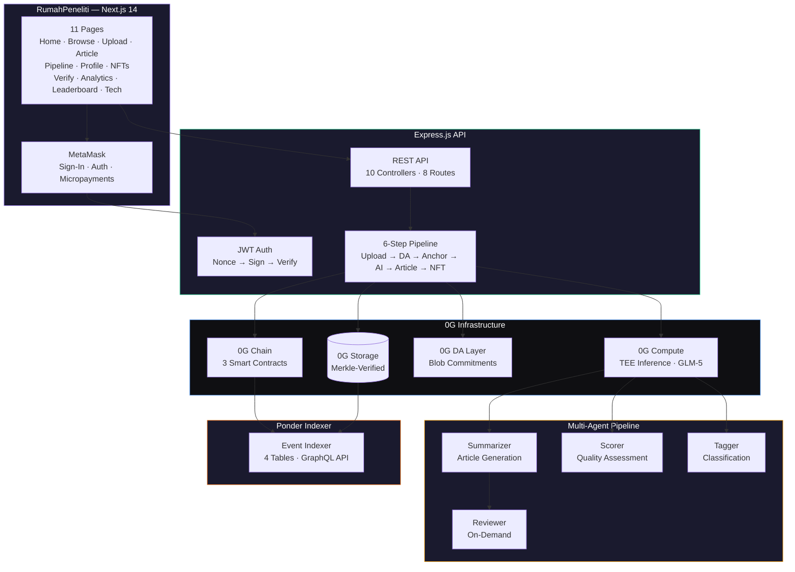
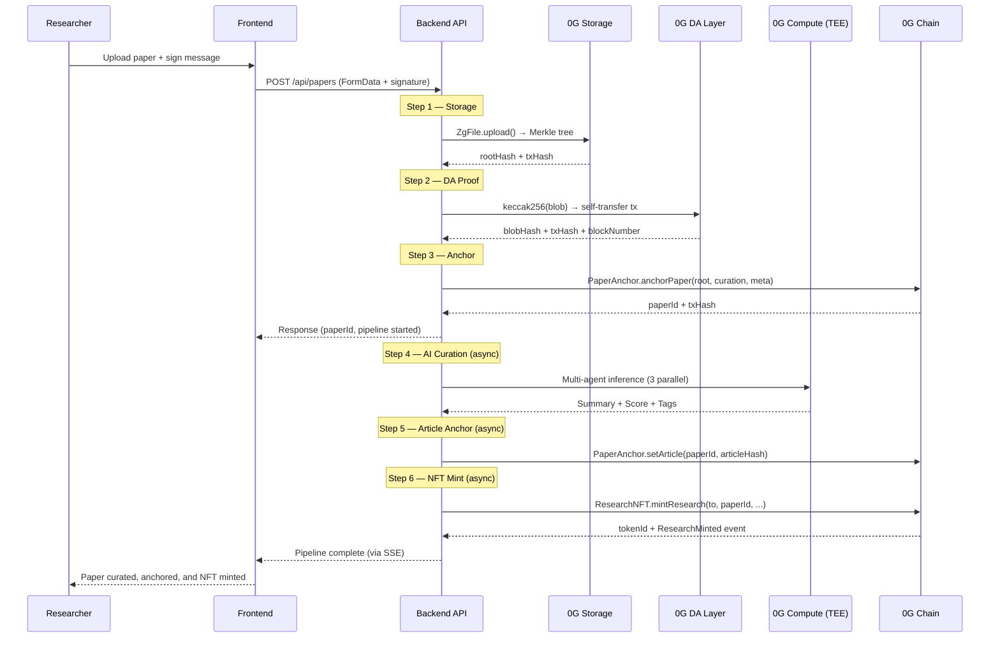
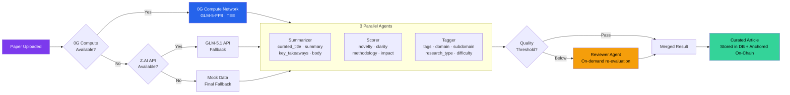
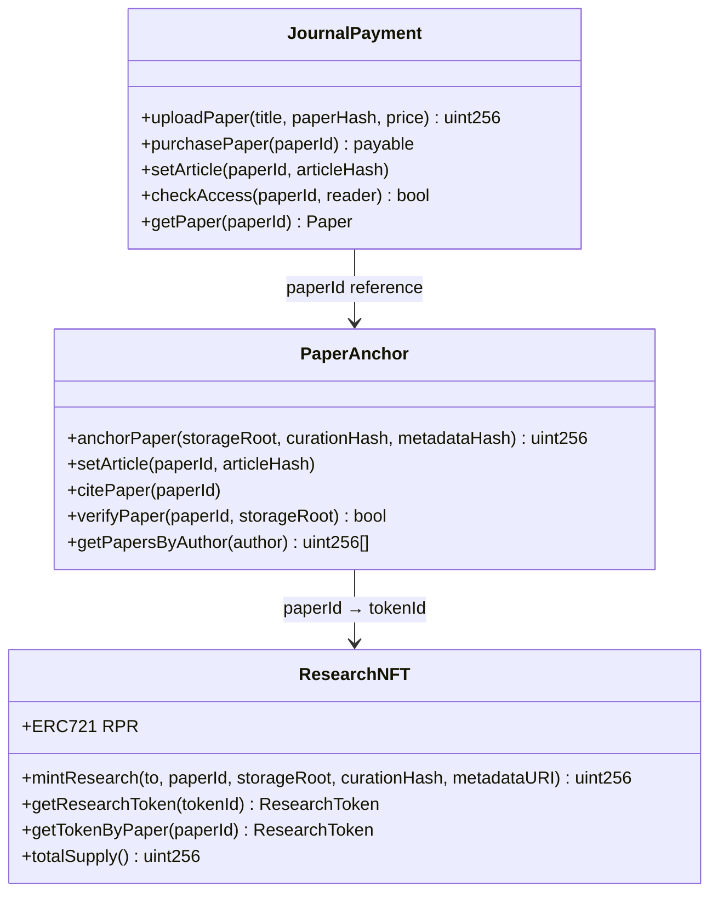

<p align="center">
  
  
  
  
  
</p>

<h1 align="center">RumahPeneliti</h1>
<h3 align="center">Decentralized Academic Research Platform on 0G</h3>

<p align="center">
  <i>Upload a paper. AI curates it. Blockchain anchors it. Readers discover it. No publisher middleman.</i>
</p>

<p align="center">
  <a href="https://rumahpeneliti.com">Live App</a> ·
  <a href="https://chainscan.0g.ai/address/0xF5E23E98a6a93Db2c814a033929F68D5B74445E2">JournalPayment</a> ·
  <a href="https://chainscan.0g.ai/address/0x410837Dd2476d7E70210063D11030D0842653f69">PaperAnchor</a> ·
  <a href="https://chainscan.0g.ai/address/0x78C414367A91917fe5DC8123119467c9910a4B6d">ResearchNFT</a>
</p>

---

> RumahPeneliti (Indonesian: "Researcher's Home") is a decentralized academic research platform built for the **0G APAC Hackathon 2026**. Researchers upload papers that are curated by a multi-agent AI pipeline (GLM-5 via **0G Compute**), stored on **0G Storage**, proven on **0G DA Layer**, anchored on **0G Chain**, and minted as NFTs. Readers discover, read, and support authors through blockchain micropayments — all gasless.

---

## The Problem

Academic publishing is broken. Researchers hand copyright to publishers who charge $30-50 per paper view, while authors receive $0. Peer review takes months. There is no AI-powered curation layer. And if a publisher goes down, decades of research disappear.

```
Researcher writes paper → Gives copyright to publisher → Publisher charges readers $40
                          → Author earns $0
                          → Review takes 6 months
                          → No AI curation, no blockchain proof, no decentralized storage
```

## The Solution

RumahPeneliti replaces the traditional publisher with a **decentralized, AI-powered pipeline**:

| Capability | What It Does | 0G Component |
|:---:|:---|:---:|
| **Decentralized Storage** | Paper files stored permanently with Merkle proofs | 0G Storage |
| **AI Curation** | 3 parallel agents + 1 reviewer via TEE inference | 0G Compute |
| **Data Availability** | Blob commitments published on-chain for proof | 0G DA Layer |
| **On-Chain Anchoring** | Paper hashes, citations, and article hashes anchored in smart contracts | 0G Chain |
| **NFT Minting** | Every curated paper becomes a transferable ERC-721 NFT | 0G Chain |
| **Micropayments** | Readers pay authors directly in 0G tokens | 0G Chain |

---

## Architecture

### System Overview



### Pipeline: Upload to NFT in ~40 Seconds



### Multi-Agent Curation Pipeline



### Smart Contract Architecture



---

## Source of Truth — On-Chain First

The backend uses a local database for fast reads and caching, but the **source of truth is always on-chain**:

- Paper files live on **0G Storage** (decentralized, Merkle-verified, permanent)
- Paper hashes and metadata are anchored on **0G Chain** via PaperAnchor contract
- A **Ponder indexer** independently indexes all on-chain events into 4 tables
- If the backend goes down, anyone can rebuild the entire index from on-chain events

---

## 0G Integration Proof

This project integrates **all 4 core 0G components**:

| Component | How It's Used | SDK |
|:---:|:---|:---|
| **0G Storage** | Paper files uploaded via `@0gfoundation/0g-ts-sdk`. Merkle tree built client-side. Root hash stored on-chain for verification. Supports upload, download. | `ZgFile`, `Indexer` |
| **0G Compute** | All AI inference via `@0glabs/0g-serving-broker`. GLM-5-FP8 model. TEE-verified responses via `processResponse()`. On-chain ledger billing with auto-deposit. | `createZGComputeNetworkBroker` |
| **0G DA Layer** | Blob commitments (`keccak256` of storage root + metadata) published as on-chain transactions. Self-transfer pattern with `RP:DA:` prefix. | `ethers.js v6` |
| **0G Chain** | 3 Solidity contracts: `JournalPayment`, `PaperAnchor`, `ResearchNFT`. Handles anchoring, micropayments, NFT minting, citations, access control. | Hardhat, ethers.js |

### Contract Addresses (0G Mainnet)

| Contract | Address | Explorer |
|:---|:---|:---:|
| JournalPayment | `0xF5E23E98a6a93Db2c814a033929F68D5B74445E2` | [View](https://chainscan.0g.ai/address/0xF5E23E98a6a93Db2c814a033929F68D5B74445E2) |
| PaperAnchor | `0x410837Dd2476d7E70210063D11030D0842653f69` | [View](https://chainscan.0g.ai/address/0x410837Dd2476d7E70210063D11030D0842653f69) |
| ResearchNFT | `0x78C414367A91917fe5DC8123119467c9910a4B6d` | [View](https://chainscan.0g.ai/address/0x78C414367A91917fe5DC8123119467c9910a4B6d) |

---

## Key Features

<table>
<tr>
<td width="50%">

### Multi-Agent AI Curation
3 parallel agents (Summarizer, Scorer, Tagger) run through 0G Compute's TEE inference. Each agent has a distinct role — one generates the article, one scores quality across 4 dimensions, one classifies and tags. A 4th Reviewer agent re-evaluates papers that fall below threshold.

</td>
<td width="50%">

### Full Pipeline — End to End
Upload → 0G Storage → DA Proof → On-Chain Anchor → AI Curation → Article Anchor → NFT Mint. The entire flow completes in ~40 seconds. Steps 1-3 are synchronous (user waits), steps 4-6 run async with SSE progress updates.

</td>
</tr>
<tr>
<td>

### Gasless UX
Backend sponsors all gas fees via a hot wallet. Users never need to hold tokens or sign transactions for NFT minting. The only wallet interaction is a single signature to verify identity on connect.

</td>
<td>

### On-Chain Verification
Paper integrity is verifiable by anyone. `PaperAnchor.verifyPaper()` checks the storage root matches the on-chain record. The Ponder indexer independently tracks all events — anchors, articles, NFTs, payments.

</td>
</tr>
<tr>
<td>

### Signature-Gated Upload
Before AI curation runs, the user must sign a submission message via MetaMask. The backend verifies this signature against the PaperAnchor contract. No signature = no AI execution. Prevents spam and ensures accountability.

</td>
<td>

### Micropayments & Donations
Authors set a price in 0G tokens (or free). Readers pay directly to the author via `JournalPayment.purchasePaper()`. No publisher takes a cut. Free papers still allow reader donations.

</td>
</tr>
<tr>
<td>

### 11 Production Pages
Home, Browse, Upload, Article Detail (with AI chat + score), Pipeline Monitor, Profile, NFT Gallery, Verify, Analytics Dashboard, Leaderboard, Tech Stack — not a prototype.

</td>
<td>

### Ponder Indexer + GraphQL
Independent blockchain event indexer with 4 tables (`paper_anchor_events`, `article_anchor_events`, `research_nft_events`, `payment_events`). Exposes REST + GraphQL API. Anyone can rebuild the index from chain.

</td>
</tr>
</table>

---

## Quick Start

### Prerequisites
- Node.js >= 18
- MetaMask or compatible wallet
- 0G tokens on Mainnet or Testnet

### Setup

```bash
git clone https://github.com/akzmee/rumah-peneliti
cd rumah-peneliti

# Install all dependencies
make install

# Configure environment
cp .env.example .env
# Edit .env — add LLM_API_KEY, PRIVATE_KEY, contract addresses
cp frontend/.env.local.example frontend/.env.local

# Database auto-seeds on first backend start
```

### Run

```bash
# Start both backend (:3001) and frontend (:3000)
make dev

# Or run individually
cd backend && npm run dev       # Express with --watch
cd frontend && npm run dev      # Next.js on :3000
cd indexer && npm run dev       # Ponder GraphQL on :42069
```

### Test

```bash
make test                       # All tests (auth + E2E)
make test-auth                  # Auth flow (24 tests)
make test-e2e                   # Full E2E browser tests (77 tests)
cd backend && npm run test:api  # Vitest API pipeline tests
```

---

## Project Structure

```
rumah-peneliti
├── backend/                     # Express.js API server
│   └── src/
│       ├── controllers/         # 10 controllers (papers, auth, analytics, nft, pipeline...)
│       ├── routes/              # 8 route modules
│       ├── services/
│       │   ├── storage.js       # 0G Storage upload (ZgFile, Indexer, Merkle)
│       │   ├── da-layer.js      # 0G DA Layer blob commitment proofs
│       │   ├── anchor.js        # PaperAnchor on-chain service
│       │   ├── og-compute.js    # 0G Compute Network client (GLM-5)
│       │   ├── multi-agent.js   # 3 parallel AI agents + orchestrator
│       │   ├── kurasi.js        # AI curation orchestrator (0G → API → Mock)
│       │   └── nft.js           # ResearchNFT gasless minting
│       ├── middleware/           # JWT auth, error handler
│       └── db.js                # SQLite setup + auto-seed
├── frontend/                    # Next.js 14 App Router
│   └── src/
│       ├── app/                 # 11 pages (home, browse, upload, article, pipeline, nfts...)
│       ├── components/          # UI components (shadcn/ui, article, home, layout, pipeline)
│       ├── contexts/            # React Context (wallet, theme, language)
│       ├── hooks/               # Custom hooks (scroll reveal)
│       └── lib/                 # Auth, API client, constants, toast
├── contracts/                   # Solidity smart contracts
│   ├── contracts/
│   │   ├── JournalPayment.sol   # Micropayments
│   │   ├── PaperAnchor.sol      # Paper hash verification + citations
│   │   └── ResearchNFT.sol      # ERC-721 NFT minting
│   └── scripts/                 # Deploy scripts (testnet + mainnet)
├── indexer/                     # Ponder blockchain event indexer
│   ├── ponder.config.ts         # Chain config + contract addresses
│   ├── ponder.schema.ts         # 4 tables schema
│   └── src/                     # Event handlers + Hono REST API
└── e2e/                         # Playwright E2E test suite (77 tests)
```

---

## Tech Stack

| Layer | Technology |
|:---|:---|
| Smart Contracts | Solidity 0.8.20, Hardhat, OpenZeppelin v5 (ERC-721, Ownable) |
| AI Inference | GLM-5-FP8 via 0G Compute (TEE), Z.AI GLM-5.1 API (fallback) |
| 0G Storage | `@0gfoundation/0g-ts-sdk` — Merkle proofs, upload/download |
| 0G Compute | `@0glabs/0g-serving-broker` — TEE inference, on-chain billing |
| Backend | Express.js, better-sqlite3, JWT auth, Multer |
| Frontend | Next.js 14, React 18, Tailwind CSS, shadcn/ui (Radix), Ethers.js v6 |
| Indexer | Ponder v0.7, PGLite, Viem, Hono |
| Blockchain | 0G Mainnet (Chain ID 16661) |
| Testing | Vitest (API), Playwright (E2E) — 101 tests passing |

---

## Key Differentiators

| | RumahPeneliti | Traditional Publisher |
|:---|:---|:---|
| **Storage** | 0G Storage (decentralized, permanent) | Centralized servers |
| **Curation** | Multi-agent AI (GLM-5, TEE-verified) | Manual peer review (months) |
| **Payments** | Direct to author, 0% cut | $30-50 per view, author gets $0 |
| **Ownership** | ERC-721 NFT (transferable) | Copyright transferred to publisher |
| **Verification** | On-chain hash + Merkle proof | None |
| **Availability** | Decentralized + independently indexable | Single point of failure |

---

## License

MIT

---

<p align="center">
  Built for the <a href="https://www.hackquest.io/hackathons/0G-APAC-Hackathon">0G APAC Hackathon 2026</a> (Track 3: Agentic Economy)
  <br/>
  <b>#0GHackathon #BuildOn0G</b>
</p>
